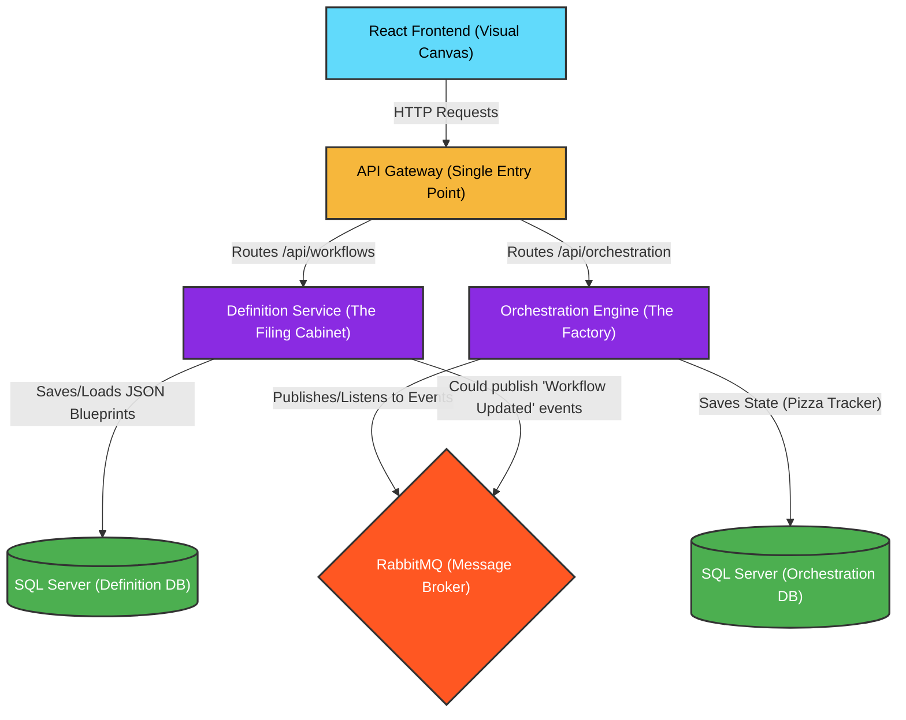

# FlowForge: Enterprise Architecture

This document serves as the high-level roadmap and architectural overview for the FlowForge visual orchestrator system.

## 3D Architecture Visualization

## The Microservices Flow (Mermaid Diagram)

## What Does Each Piece Do?

### 1. React Frontend (The Visual Canvas)
This is the only thing the user sees. It uses React Flow to draw nodes and edges. It does NOT execute workflows. It simply generates a JSON "blueprint" of what the workflow *should* look like, and sends it to the backend.

### 2. API Gateway (The Front Desk Receptionist)
In a real enterprise, the frontend shouldn't have to memorize the IP addresses and ports of 50 different microservices. Instead, the frontend sends *all* requests to the API Gateway. The Gateway looks at the URL and routes it to the correct microservice. 

### 3. Definition Service (The Filing Cabinet)
This microservice has exactly one job: **CRUD (Create, Read, Update, Delete) for blueprints.**
When the user clicks "Save" on the frontend, the JSON blueprint goes here and is stored in the Definition Database. It does not know *how* to run a workflow; it just stores the instructions.

### 4. Orchestration Engine (The Factory)
This is the heavy lifter. When a user clicks "Run Workflow", this service wakes up. 
It uses **MassTransit and RabbitMQ** to track the state of the workflow (e.g., "Step 1 is running... Step 2 is pending..."). It uses **System.Threading.Channels** to actually execute the physical code (like sending an email or calling an external API). It saves its memory to the Orchestration Database so it never forgets where it left off if the server crashes.
